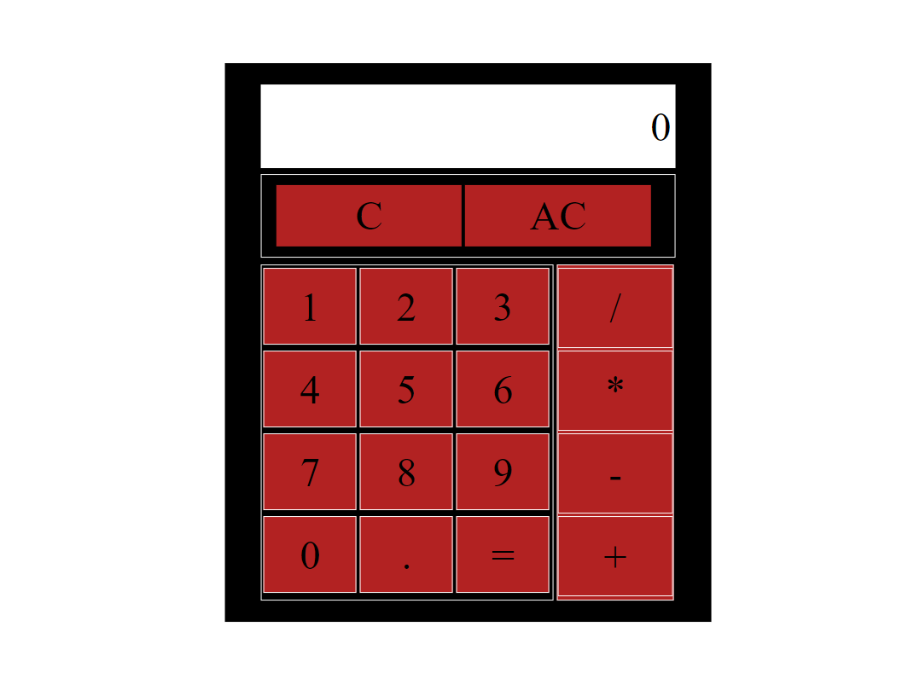

# Calculator [WIP]
- A calculator application created for lower grade students to do math homework

> - Maintained by: `James Dinh - jdinh8124`

## Live Demo
Link: [Live Site](https://calculator.jamestdinh.com/)

## Technologies Used
- JavaScript
- HTML5
- CSS3

## Features
- User add, subtract, divide, and multiply simple math problems

## Future Additions
- Graphical calculations

## Preview

