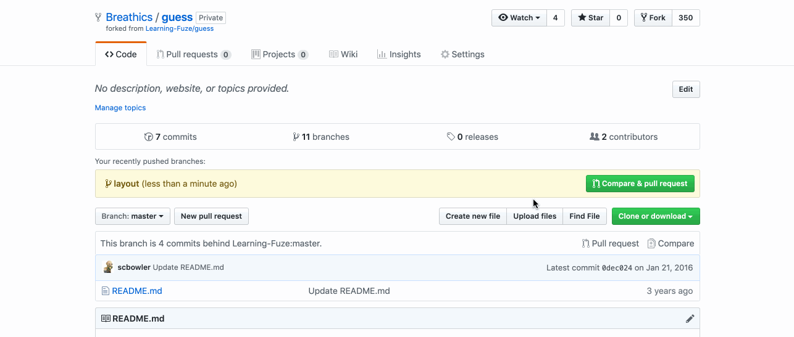
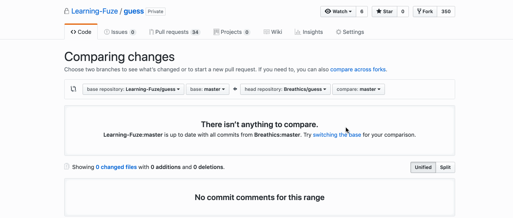
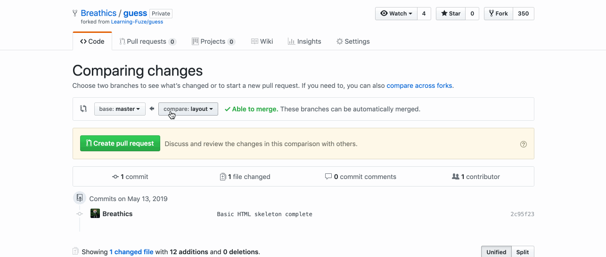
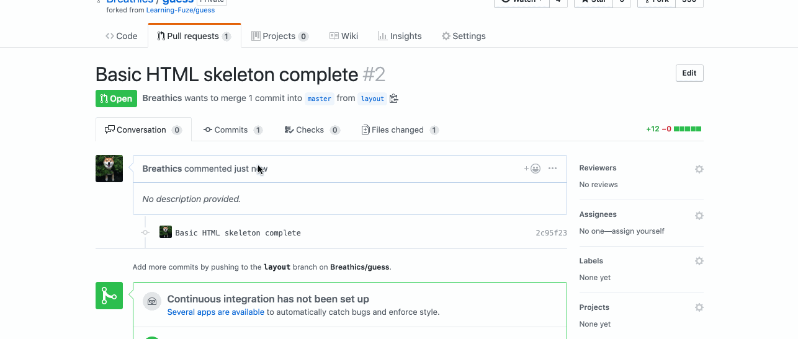
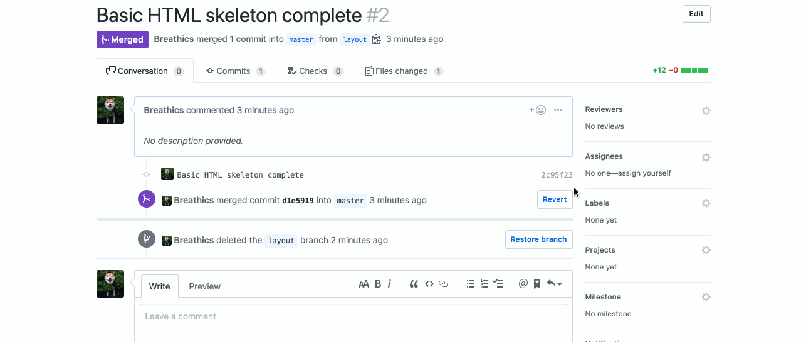

Instructions - Skeleton
--

### Overview

In this feature, you are creating the skeleton of elements that will hold any additional elements that will make up the project you are creating. Design docs are provided to illustrate what you will be building toward using HTML and CSS.

- In an `index.html` file, your `<body>` will have three main sections:
  - `<header>`, will be used for a heading and/or logo.
    - It will contain a single text element to hold the title.
  - `<aside>`, will be used to hold data / information regarding game stats.
    - You will use a single text element for the "stats" title.
    - You will use six divs for the stats content as shown in the design doc.
    - Each div will contain a single text element to hold the text content.
  - `<main>`, will be used to hold the cards to play through your Memory Match game.
    - You will create the following structure:
      - A "container" div which will contain all of the cards.
      - Inside of that container, you will include a div for each of the 18 cards.
      - You will then nest two child divs in each of the card divs.
        - The first child will hold the "lfz-card" background-image.
        - The second child will hold the background images you are trying to match.
- In a `style.css` file, include the CSS properties to get a rough match of the provided design doc.
  - Keep in mind that the initial build will be for a static page.
  - It will be refactored into full responsiveness prior to inclusion in your portfolio, but:
    - You do not have the time for a responsive build at this point.
    - Focus on learning how to position elements on the page.
      - Create classes on the elements you want to apply CSS to, use those classes for CSS selection.
        - Do not use ids for styling, ids are for JavaScript selection.
      - Use borders / background colors to ease the viewing of the elements you want to position on the page.
      - Use the styles feature of the Chrome Inspector to make changes in real time.
  - And Lastly, CSS is hard! Make sure to ask questions and keep at it!

### Design Docs

#### Initial Build

#### Final Design with all assests

#### With cards flipped to show images

### After Each Feature

- When your feature implementation is complete, you will want to save and submit your work to the branch that you have created.
  - Use `git status` to check that you are on the correct branch that represents your feature.
  - You will want to **add**, **commit**, and **push** the code that you have written to the appropriate Github repository.
    1. `git add .`
    2. `git commit -m "Description of the feature that you have implemented"`
       - e.g. `git commit -m "Added simple HTML skeleton"`
    3. `git push origin FEATURE_NAME_HERE`
       - e.g. `git push origin skeleton`

- Finally, you will want to create a pull request. This will merge the code from your newly **completed** feature branch into your `master` branch.

  1. Navigate to <kbd>New Pull Request</kbd>:
  
  2. Compare changes to merge:
  
  3. Create a new pull request:
  
  4. Merge pull request:
  
  5. Update master with the new changes:
  
  6. Go back to [Features](../../README.md#features), if you're still working through the project.
